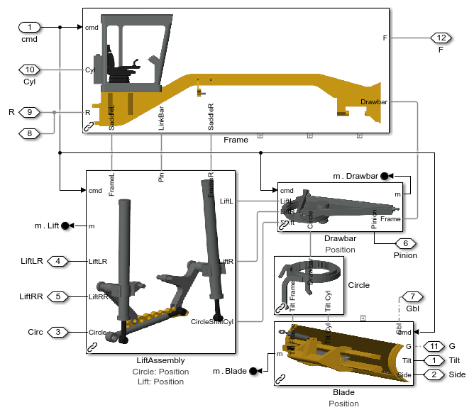

# **Motor Grader Design with Simscape**

This example models a motor grader with fully actuated drawbar, blade, 
front axle steer and lean systems.  Test harness models let you test
individual systems.

* **Size actuators** using prescribed motion for cylinder positions. 
* **Tune control systems** using abstract actuation systems.
* **Explore kinematics** of drawbar linkage.
* **Measure mechanical loads** with abstract models for fast simulation.
* **Test powertrain architectures** with CVT models, including power split designs.
* **Develop operator assist** algorithms within Simulink

## Setup 
Open the project file Motor_Grader_Simscape.prj to get started.

## **Motor Grader Animation Clip**

## **Model of Motor Grader**

## **Motor Grader Subsystems**

## **Drawbar and Blade Actuation Systems**

To learn more about modeling and simulation with Simscape, please visit:
* [Simscape Getting Started Resources](https://www.mathworks.com/solutions/physical-modeling/resources.html)
* Product Capabilities:
   * [Simscape&trade;](https://www.mathworks.com/products/simscape.html)
   * [Simscape Battery&trade;](https://www.mathworks.com/products/simscape-battery.html)
   * [Simscape Driveline&trade;](https://www.mathworks.com/products/simscape-driveline.html)
   * [Simscape Electrical&trade;](https://www.mathworks.com/products/simscape-electrical.html)
   * [Simscape Fluids&trade;](https://www.mathworks.com/products/simscape-fluids.html)
   * [Simscape Multibody&trade;](https://www.mathworks.com/products/simscape-multibody.html)

## License
The license is available in the LICENSE.md file in this GitHub repository.

## Community Support
[MATLAB Central](https://www.mathworks.com/matlabcentral)

Copyright 2025 The MathWorks, Inc.